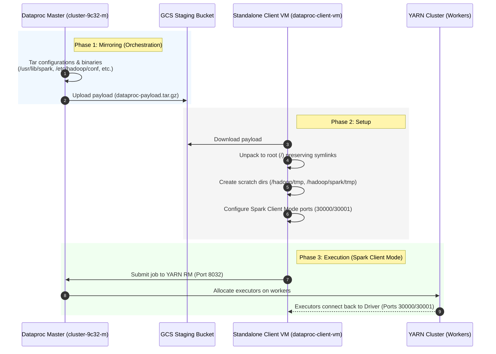

# Dataproc Client VM Integration Lab

This project demonstrates how to deploy and configure a standalone Google Compute Engine (GCE) virtual machine (VM) as a **fully functional Dataproc Client**. 

Once configured, this client VM can submit Spark (in both YARN Cluster and Client modes), PySpark, and SparkSQL/Hive jobs directly to an existing Dataproc cluster, leveraging the cluster's resources while running the driver locally or orchestrating from the VM.

---

## Architecture Overview

This lab uses a **high-speed internal mirroring strategy** to configure the client VM. Instead of installing Spark, Hadoop, and Hive from scratch (which risks version mismatches), the orchestration script packages the pre-installed, pre-configured binaries and configuration files directly from the Dataproc Master node, transfers them via Google Cloud Storage (GCS) at gigabit speeds, and extracts them onto the client VM.



---

## Project Structure

*   **`run_lab.sh`**: The main orchestration script. It coordinates the provisioning of the VM/bucket, triggers the packaging on the Dataproc master, copies setup scripts to the client VM, and executes the setup and verification suites.
*   **`provision_resources.sh`**: Provisions the standalone GCE VM (Debian 12, `n4-standard-4`) and the GCS staging bucket. It dynamically queries the target Dataproc cluster's UUID and attaches critical Dataproc metadata to the VM.
*   **`scripts/setup_client.sh`**: Runs on the client VM. It installs Java 17, creates the required Hadoop/Spark scratch directories, extracts the mirrored binaries, configures environment variables, disables environment-incompatible Dataproc plugins, and configures Spark client-mode port bindings.
*   **`scripts/verify_client.sh`**: The integration test suite. It runs 4 comprehensive tests to verify GCS connectivity, YARN Cluster Mode, YARN Client Mode (requires bidirectional networking), and Hive Beeline connectivity.
*   **`cleanup_resources.sh`**: Safely tears down the resources created for this lab (the client VM and the GCS bucket) without touching the Dataproc cluster or the VPC network.

---

## Under the Hood: Advanced Technical Solutions

This integration implements several sophisticated solutions to overcome common challenges when running Spark outside a managed Dataproc cluster:

### 1. Spark Client Mode & Firewall Traversal
In Spark **Client Mode**, the Spark Driver runs locally on the client VM, while the Executors run on the Dataproc workers. The executors must be able to connect back to the driver. 
By default, Spark assigns random ports for this communication, which is impossible to secure with firewalls. 
We resolve this in `setup_client.sh` by pinning the driver and block manager ports and configuring the host:
```properties
spark.driver.port 30000
spark.blockManager.port 30001
spark.driver.host dataproc-client-vm
```
Combined with the VPC's `internalaccess` firewall rule, this allows seamless bidirectional communication between the VM and the cluster workers.

### 2. Satisfying the Dataproc Environment Validator
Google's Dataproc Spark distribution includes a core validator (`com.google.cloud.dataproc.SparkDataprocEnvValidator`). When you initialize a `SparkContext` in Client Mode, the driver runs on the standalone VM and the validator checks if the machine is a valid Dataproc node. If it isn't, it throws:
`ERROR SparkDataprocEnvValidator: Unauthorized Dataproc environment detected, terminating process.`

We bypass this security check by **spoofing the Dataproc GCE metadata** on the client VM. During provisioning, `provision_resources.sh` dynamically queries the target cluster's UUID and applies the following metadata keys to the client VM:
*   `dataproc-cluster-name`
*   `dataproc-cluster-uuid`
*   `dataproc-role=Master`
*   `dataproc-region`

When the validator queries the GCE metadata server, it finds these keys and authorizes the environment.

### 3. Hadoop Scratch Directories & Permissions
Dataproc configurations reference specific local directories for temporary data and caches (e.g., `hadoop.tmp.dir` is set to `/hadoop/tmp`, and Spark local dirs point to `/hadoop/spark/tmp`).
On a standard GCE VM, these directories do not exist, and standard users do not have permissions to write to `/` (root) to create them, leading to `AccessDeniedException` or `IOException: No such file or directory` during job submission.
We resolve this in `setup_client.sh` by pre-creating these directories as `root` and setting their permissions to `1777` (world-writable with a sticky bit, identical to `/tmp`):
```bash
sudo mkdir -p /hadoop/tmp /hadoop/spark/tmp /hadoop/spark/work
sudo chmod 1777 /hadoop/tmp /hadoop/spark/tmp /hadoop/spark/work
```

---

## Getting Started

### Prerequisites
1.  An active Google Cloud project (e.g., `binggang-lab`).
2.  An existing, running Dataproc cluster (e.g., `cluster-9c32` in `us-central1-b`).
3.  An existing VPC network (e.g., `local-lab`) with:
    *   A subnet in the same region as the cluster (e.g., `local-lab-us` in `us-central1`).
    *   A firewall rule allowing internal traffic between VMs in the VPC (e.g., `10.0.0.0/18`).
    *   A firewall rule allowing SSH via IAP (`35.235.240.0/20`).

### Running the Lab
To provision, configure, and verify the client VM in one go, simply run the orchestration script:
```bash
./run_lab.sh
```

### Running with an Existing Dataproc Cluster and VM
If you already have a running Dataproc cluster and an existing GCE VM that you want to configure manually as a client:

#### 1. Apply Dataproc Metadata to the VM
The VM must have the target Dataproc cluster's metadata attached to it. This allows the Spark Environment Validator on the VM to authorize the environment.
Run the following `gcloud` command from your workstation:
```bash
# Query the cluster's UUID
CLUSTER_UUID=$(gcloud dataproc clusters describe <CLUSTER_NAME> \
  --region=<REGION> \
  --format="value(clusterUuid)")

# Apply the metadata to your existing VM
gcloud compute instances add-metadata <VM_NAME> \
  --zone=<VM_ZONE> \
  --metadata="dataproc-cluster-name=<CLUSTER_NAME>,dataproc-cluster-uuid=${CLUSTER_UUID},dataproc-role=Master,dataproc-region=<REGION>"
```

#### 2. Package Configurations and Stage Packages
Make sure you have run the staging script. This will download standard jars, package Spark from your master node, and package the cluster configurations, uploading all of them to your GCS bucket:
```bash
bash prepare_packages.sh
```

#### 3. Run the Setup on the VM
Copy the setup script to your VM and execute it:
```bash
# Copy the script to the VM
gcloud compute scp scripts/setup_client.sh <VM_NAME>:/tmp/ --zone=<VM_ZONE> --tunnel-through-iap

# SSH into the VM and run the setup
gcloud compute ssh <VM_NAME> --zone=<VM_ZONE> --tunnel-through-iap
# Run inside the VM:
chmod +x /tmp/setup_client.sh
/tmp/setup_client.sh dataproc-client-lab-<PROJECT_ID>
```

### Manual Usage & Verification
Once the lab completes successfully, you can manually SSH into the client VM to submit jobs:
```bash
# SSH into the client VM
gcloud compute ssh dataproc-client-vm --zone=us-central1-f --tunnel-through-iap

# Load the Dataproc environment variables
source /etc/profile.d/dataproc-env.sh

# Submit a Spark job in YARN Client Mode (Driver runs on this VM)
spark-submit \
    --master yarn \
    --deploy-mode client \
    $SPARK_HOME/examples/src/main/python/pi.py 10

# Connect to Hive Server via Beeline
beeline -u "jdbc:hive2://cluster-9c32-m:10000" -n hive -p hive -e "SHOW DATABASES;"
```

### Cleaning Up
To tear down the client VM and the GCS bucket, leaving the Dataproc cluster and network intact:
```bash
./cleanup_resources.sh
```
