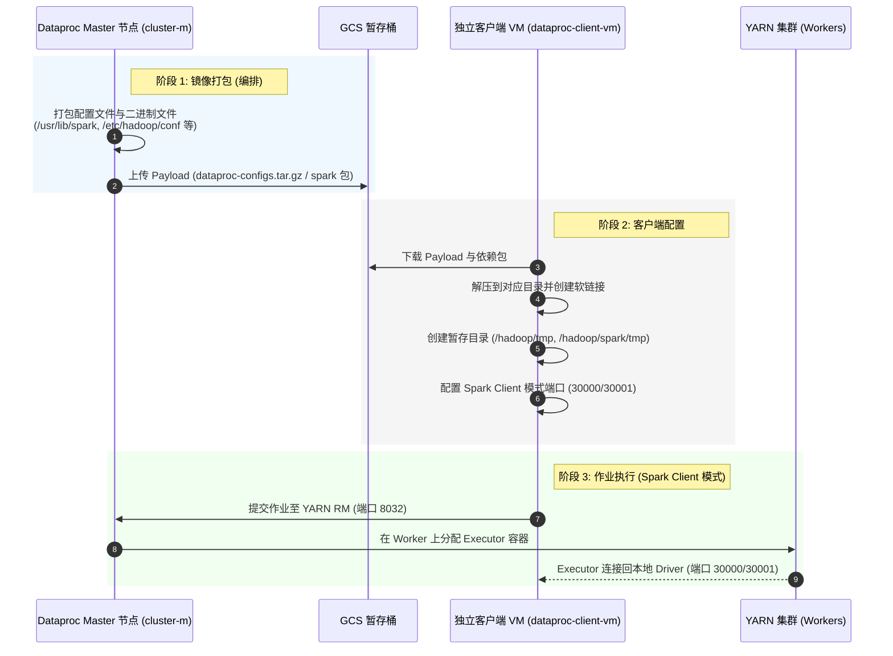

# Dataproc 客户端 VM 集成实验 (Dataproc Client VM Integration Lab)

本项目演示了如何将一个独立的 Google Compute Engine (GCE) 虚拟机 (VM) 部署并配置为**完全功能的 Dataproc 客户端**。

配置完成后，该客户端 VM 可以直接向现有的 Dataproc 集群提交 Spark 作业（支持 YARN Cluster 和 YARN Client 模式）、PySpark 作业以及 SparkSQL/Hive 查询，在本地运行 Driver 或从 VM 进行任务编排的同时，充分利用 Dataproc 集群的计算资源。

---

## 架构概述

本项目采用**高速内部镜像策略**来配置客户端 VM。为了避免由于从头安装 Spark、Hadoop 和 Hive 导致的版不一致风险，编排脚本直接从 Dataproc Master 节点打包预装且预配置的二进制文件和配置文件，通过 Google Cloud Storage (GCS) 进行内网高速传输，并解压到客户端 VM 上。



---

## 项目结构

*   **`run_lab.sh`**: 主编排脚本。负责协调 VM 和 GCS 桶的创建、触发 Master 节点上的配置打包、将安装脚本复制到客户端 VM 并执行配置与验证。
*   **`prepare_packages.sh`**: 依赖包预准备脚本。负责将标准的 Hadoop、Hive 以及从 Dataproc 节点提取的兼容版 Spark 二进制包和 Delta/Iceberg 依赖 jar 包 stage 到 GCS 暂存桶中。
*   **`provision_resources.sh`**: 创建独立的 GCE VM（Debian 12，`n4-standard-4`）和 GCS 暂存桶。它会动态查询目标 Dataproc 集群的 UUID，并将关键的 Dataproc 元数据附加到 VM 上。
*   **`scripts/setup_client.sh`**: 在客户端 VM 上运行。负责安装 Java 17、创建所需的 Hadoop/Spark 临时目录、解压二进制文件、配置环境变量、禁用与外部环境冲突的 Dataproc 插件，并配置 Spark Client 模式的端口绑定。
*   **`scripts/verify_client.sh`**: 集成测试套件。运行 4 个完整的测试来验证 GCS 连接性、YARN Cluster 模式作业提交、YARN Client 模式作业提交（需要双向网络互通）以及 Hive Beeline 连接性。
*   **`cleanup_resources.sh`**: 安全地销毁为本实验创建的资源（客户端 VM 和 GCS 暂存桶），不会影响现有的 Dataproc 集群或 VPC 网络。

---

## 技术细节与解决方案

本集成方案实现了几个关键的技术解决方案，以解决在托管 Dataproc 集群之外运行 Spark 时常见的挑战：

### 1. Spark Client 模式与防火墙穿透
在 Spark **Client 模式**下，Spark Driver 运行在客户端 VM 本地，而 Executor 运行在 Dataproc 的 Worker 节点上。Executor 必须能够连接回 Driver。
默认情况下，Spark 会为这种通信随机分配端口，这在有防火墙限制的 VPC 中是无法工作的。
我们在 `setup_client.sh` 中通过固定 Driver 和 Block Manager 的端口以及配置 Host 来解决此问题：
```properties
spark.driver.port 30000
spark.blockManager.port 30001
spark.driver.host <VM_INTERNAL_IP>
```
结合 VPC 的 `internalaccess` 防火墙规则，这允许 VM 与集群 Worker 之间进行无缝的双向通信。

### 2. 绕过 Dataproc 环境验证器 (Metadata Spoofing)
Google 的 Dataproc Spark 发行版包含一个核心验证器 (`com.google.cloud.dataproc.SparkDataprocEnvValidator`)。当您在 Client 模式下初始化 `SparkContext` 时，Driver 运行在独立 VM 上，验证器会检查该机器是否为合法的 Dataproc 节点。如果不是，它会抛出以下致命错误并终止 JVM：
`ERROR SparkDataprocEnvValidator: Unauthorized Dataproc environment detected, terminating process.`

我们通过在独立 VM 上**欺骗 (Spoofing) GCE 元数据**来绕过此安全检查。在创建 VM 时，`provision_resources.sh` 会动态查询目标集群的 UUID，并将以下元数据键值对附加到 VM 上：
*   `dataproc-cluster-name`
*   `dataproc-cluster-uuid`
*   `dataproc-role=Master`
*   `dataproc-region`

当验证器请求本地元数据服务器时，它会读取到这些属性，从而认为该 VM 是合法的 Master 节点并予以放行。

### 3. 解决 Spark 序列化版本不兼容问题
Dataproc 使用的是其自身维护的 Spark 分支（例如 `dataproc-branch-3.5.3`）。即使版本号与官方标准 Apache Spark（如 `3.5.3`）完全一致，两者的内部类（如 `SparkAppConfig`）的 Java `serialVersionUID` 也是不同的。
如果客户端使用标准的 Apache Spark 镜像，在连接 YARN 时会报 `InvalidClassException` 导致任务挂起。
**解决方案**：我们直接从 Dataproc Master 节点的 `/usr/lib/spark` 目录打包二进制文件作为客户端的 Spark 基础，确保了 100% 的二进制兼容性。

---

## 开始使用

### 前提条件
1.  一个处于活动状态的 Google Cloud 项目（例如 `binggang-lab`）。
2.  一个正在运行的 Dataproc 集群（例如 `jmsau-test`）。
3.  一个现有的 VPC 网络，并且满足：
    *   在集群所在区域拥有子网（例如 `local-lab-us`）。
    *   拥有允许 VPC 内部 VM 之间互通所有流量的防火墙规则（例如 `10.0.0.0/18`）。
    *   拥有允许通过具有恒定 IP 的 IAP 进行 SSH 连接的防火墙规则 (`35.235.240.0/20`)。

### 自动运行实验
如果您希望自动创建测试 VM、暂存桶并完成配置与测试，只需在工作站运行：
```bash
./run_lab.sh
```

---

### 在现有的 Dataproc 集群和 VM 上手动配置
如果您已经有一个运行中的 Dataproc 集群和一个现有的 GCE VM，并希望手动将其配置为客户端：

#### 1. 将 Dataproc 元数据附加到现有 VM
必须将目标 Dataproc 集群的元数据附加到您的 VM 上，以便绕过环境验证器。
在您的工作站（非 VM 内）运行以下 `gcloud` 命令：
```bash
# 1. 查询集群的 UUID
CLUSTER_UUID=$(gcloud dataproc clusters describe <您的集群名称> \
  --region=<您的集群区域> \
  --format="value(clusterUuid)")

# 2. 将元数据附加到您现有的 VM
gcloud compute instances add-metadata <您的VM名称> \
  --zone=<您的VM所在的Zone> \
  --metadata="dataproc-cluster-name=<您的集群名称>,dataproc-cluster-uuid=${CLUSTER_UUID},dataproc-role=Master,dataproc-region=<您的集群区域>"
```

#### 2. 在 GCS 中准备并暂存包
在工作站运行准备脚本，将 Spark 二进制文件和 Hive 依赖包上传到您的 GCS 暂存桶中：
```bash
# 该脚本会自动从您的 Master 节点打包 Spark，并从 Maven 下载标准 jar 包上传至 GCS
bash prepare_packages.sh
```

同时，手动打包并上传集群的配置文件（在 Dataproc Master 节点上运行）：
```bash
# 在 Dataproc Master 节点上运行：
sudo tar -chzf /tmp/dataproc-configs.tar.gz -C / etc/hadoop/conf etc/spark/conf etc/hive/conf
gsutil cp /tmp/dataproc-configs.tar.gz gs://dataproc-client-lab-<您的项目ID>/configs/
```

#### 3. 在 VM 上执行安装
将配置脚本复制到您的 VM 并执行它：
```bash
# 将脚本复制到 VM (在工作站运行)
gcloud compute scp scripts/setup_client.sh <您的VM名称>:/tmp/ --zone=<您的VM区域> --tunnel-through-iap

# SSH 进入您的 VM
gcloud compute ssh <您的VM名称> --zone=<您的VM区域> --tunnel-through-iap

# 在 VM 内部运行：
chmod +x /tmp/setup_client.sh
/tmp/setup_client.sh dataproc-client-lab-<您的项目ID>
```

---

## 手动使用与验证

配置成功后，您可以随时 SSH 进入客户端 VM 并提交作业：

```bash
# SSH 进入客户端 VM
gcloud compute ssh dataproc-client-vm --zone=us-central1-f --tunnel-through-iap

# 导入 Dataproc 环境变量
source /etc/profile.d/dataproc-env.sh

# 1. 使用 spark-submit 以 YARN Client 模式提交作业（Driver 运行在本地 VM 上）
spark-submit \
    --master yarn \
    --deploy-mode client \
    $SPARK_HOME/examples/src/main/python/pi.py 10

# 2. 使用 spark-sql 交互式查询
spark-sql
# 在 spark-sql 终端中运行：
spark-sql> SHOW DATABASES;
spark-sql> SELECT 1;

# 3. 使用 Beeline 连接 Hive Server 2
beeline -u "jdbc:hive2://<您的Master节点名称>:10000" -n hive -p hive -e "SHOW DATABASES;"
```

---

## 资源清理
要销毁为本实验创建的测试 VM 和 GCS 暂存桶（不会影响您的 Dataproc 集群）：
```bash
./cleanup_resources.sh
```
