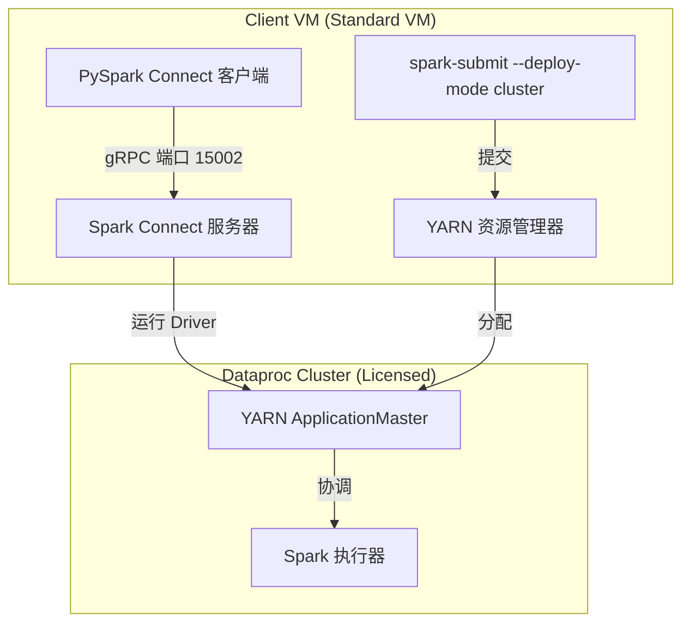

# Dataproc 客户端虚拟机集成实验室

本项目演示了如何将独立的 Google Compute Engine (GCE) 虚拟机 (VM) 部署和配置为 **功能完备的 Dataproc 客户端**。该方案采用了一种混合执行模型。

配置完成后，此客户端虚拟机可以：
1.  以 **YARN 集群模式** (Driver 在集群中运行) 向 Dataproc YARN 集群提交 Spark 和 PySpark 作业。
2.  通过 **Spark Connect** 与集群进行交互式连接 (Driver 在集群中运行，客户端通过 gRPC 发送查询计划)。
3.  通过 Beeline 连接到 **HiveServer2** 以执行 SQL 查询。
4.  直接从 Google Cloud Storage (GCS) 读取和写入数据。

---

## 架构概述

传统的 YARN 客户端模式 (Spark Driver 在本地独立虚拟机上运行) 在标准 GCE 虚拟机上会被阻止，因为 Google 自定义的 Spark 分支包含一个需要 Dataproc GCE 许可证的环境验证器。

为了在不管理复杂的 GCE 许可证的情况下绕过此限制，本实验室实现了一种**混合执行模型**：

*   **批处理作业 (YARN 集群模式)**: 客户端虚拟机将作业提交给 YARN。Driver 在 Dataproc 主节点 (拥有许可证) 上启动，完全绕过了本地验证器。
*   **交互式会话 (Spark Connect)**: 客户端虚拟机在 Dataproc 集群上启动 Spark Connect gRPC 服务器。然后，客户端虚拟机运行一个轻量级的 Python 客户端，该客户端通过 gRPC (端口 `15002`) 发送查询计划。这完全避免了 Java 序列化不匹配和本地环境验证问题。



---

## 项目结构

*   **`config.env`**: 实验室的唯一事实来源。包含项目 ID、区域、可用区、集群名称、VM 名称和 GCS 存储桶名称。所有编排脚本都会加载此文件。
*   **`run_lab.sh`**: 主编排脚本。加载 `config.env`，配置虚拟机和存储桶，复制安装脚本，配置虚拟机，并运行验证套件。
*   **`provision_resources.sh`**: 配置独立的 GCE 虚拟机 (Debian 12, `n4-standard-4`) 和 GCS 暂存存储桶。
*   **`prepare_packages.sh`**: 从活动的集群中打包自定义的 Dataproc Spark 二进制文件，并将它们与标准的 Hadoop/Hive 包一起暂存在 GCS 中。
*   **`scripts/setup_client.sh`**: 在客户端虚拟机上运行。解压软件包，安装 Python 依赖项 (`pandas`, `pyarrow`, `grpcio`)，配置环境配置，并部署 Spark Connect 辅助脚本。
*   **`scripts/start_spark_connect.sh`**: 虚拟机上的辅助脚本，通过 SSH 连接到主节点，在 YARN 上启动 Spark Connect 服务器，并轮询端口 `15002` 直到其准备就绪。
*   **`scripts/stop_spark_connect.sh`**: 虚拟机上的辅助脚本，用于停止集群上的 Spark Connect 服务器。
*   **`scripts/check_spark_connect.sh`**: 独立的健康检查脚本，用于验证 Spark Connect 服务器的网络端口并执行测试查询。
*   **`scripts/verify_integration.sh`**: 集成测试套件。运行 5 项全面的测试 (GCS 读取、Hive 临时表读写、Spark Submit Scala、PySpark YARN 集群写读和 Spark Connect)。
*   **`cleanup_resources.sh`**: 清理虚拟机和 GCS 存储桶。

---

## 开始使用

### 1. 配置实验室
编辑项目根目录下的 [config.env](file:///usr/local/google/home/binggangwo/project/dataproc-integration-lab/config.env) 文件，设置您的 Google Cloud 参数：
```properties
PROJECT_ID="your-project-id"
CLUSTER_NAME="your-dataproc-cluster-name"
CLUSTER_ZONE="cluster-master-zone"
REGION="cluster-region"
VM_NAME="dataproc-client-vm-v1-hybrid"
VM_ZONE="client-vm-zone"
BUCKET_NAME="dataproc-client-lab-your-project"
```

### 2. 暂存软件包
在部署虚拟机之前，必须将 Spark/Hadoop/Hive 二进制文件暂存在 GCS 存储桶中。在您的工作站上运行以下命令 (需要目标 Dataproc 集群正在运行)：
```bash
bash prepare_packages.sh
```

### 3. 运行编排
只需运行以下编排脚本，即可一步完成客户端虚拟机的配置、配置和验证：
```bash
bash run_lab.sh
```
*在运行结束时，您将看到一个统一的测试报告，显示所有 5 个集成测试的状态。*

---

## 手动使用与验证

虚拟机配置完成后，您可以登录并与集群进行交互：

### 1. SSH 登录到客户端虚拟机
```bash
gcloud compute ssh dataproc-client-vm-v1-hybrid --zone=us-central1-f --tunnel-through-iap
```

### 2. 加载环境变量
```bash
source /etc/profile.d/dataproc-env.sh
```

### 3. 运行 YARN 集群模式作业 (Scala)
```bash
spark-submit \
  --master yarn \
  --deploy-mode cluster \
  --class org.apache.spark.examples.SparkPi \
  /opt/spark/examples/jars/spark-examples_2.12-3.5.3.jar 10
```

### 4. 通过 Spark Connect 进行交互式工作 (Python)
要使用集群的 Spark 资源启动交互式 Python 会话：

1.  **在集群上启动 Spark Connect 服务器**：
    ```bash
    ./start_spark_connect.sh
    ```
    *此脚本将在 YARN 上启动服务器，并等待端口 15002 处于活动状态。*

2.  **启动 PySpark Connect**：
    启动指向远程服务器的 PySpark shell (启动脚本将打印确切的 FQDN)：
    ```bash
    pyspark --remote "sc://<master-node-fqdn>:15002"
    ```
    *在 shell 内部，您可以运行 DataFrame 和 SQL 操作 (例如 `spark.sql("SELECT 1").show()`)，这些操作将在 YARN 集群上执行。*

3.  **随时检查健康状态**：
    您可以运行独立的健康检查来验证连接：
    ```bash
    ./check_spark_connect.sh
    ```

4.  **完成后停止服务器**：
    释放 YARN 资源：
    ```bash
    ./stop_spark_connect.sh
    ```

---

## 清理资源
要删除客户端虚拟机和 GCS 存储桶，并保持 Dataproc 集群完好无损：
```bash
./cleanup_resources.sh
```
